# [📈 Live Status](https://Certegy-Payment-Solutions.github.io/upptime): <!--live status--> **🟧 Partial outage**

This repository contains the open-source uptime monitor and status page for [Certegy-Payment-Solutions](https://Certegy-Payment-Solutions.github.io/upptime), powered by [Upptime](https://github.com/upptime/upptime).

## Certegy System Status

This repository contains the uptime monitor and status page for Certegy Payment Solutions, powered by [Upptime](https://github.com/upptime/upptime).

### mTLS Support

This implementation includes support for monitoring endpoints that require mutual TLS (mTLS) authentication. The following components have been added:

- **mtls-helper.js**: A helper script for making HTTPS requests with mTLS authentication
- **check-mtls-endpoints.js**: A script that checks endpoints marked with `mtls: true` in the configuration
- **mtls-check.yml**: A GitHub Actions workflow that runs the mTLS check script

To configure an endpoint to use mTLS authentication, add `mtls: true` to its configuration in `.upptimerc.yml`:

```yaml
- name: My mTLS Endpoint
  url: https://example.com/api
  mtls: true
```

The mTLS certificate is stored as a GitHub secret (`MTLS_CERTIFICATE`) and is used by the check script to authenticate with the endpoints.

[](https://github.com/Certegy-Payment-Solutions/upptime/actions?query=workflow%3A%22Uptime+CI%22)
[](https://github.com/Certegy-Payment-Solutions/upptime/actions?query=workflow%3A%22Response+Time+CI%22)
[](https://github.com/Certegy-Payment-Solutions/upptime/actions?query=workflow%3A%22Graphs+CI%22)
[](https://github.com/Certegy-Payment-Solutions/upptime/actions?query=workflow%3A%22Static+Site+CI%22)
[](https://github.com/Certegy-Payment-Solutions/upptime/actions?query=workflow%3A%22Summary+CI%22)

With [Upptime](https://upptime.js.org), you can get your own unlimited and free uptime monitor and status page, powered entirely by a GitHub repository. We use [Issues](https://github.com/Certegy-Payment-Solutions/upptime/issues) as incident reports, [Actions](https://github.com/Certegy-Payment-Solutions/upptime/actions) as uptime monitors, and [Pages](https://Certegy-Payment-Solutions.github.io/upptime) for the status page.

<!--start: status pages-->
<!-- This summary is generated by Upptime (https://github.com/upptime/upptime) -->
<!-- Do not edit this manually, your changes will be overwritten -->
<!-- prettier-ignore -->
| URL | Status | History | Response Time | Uptime |
| --- | ------ | ------- | ------------- | ------ |
|  [CoreWebService (SOAP V1) - CCE](https://cce-soap-retail.certegy.com/v1) | 🟥 Down | [core-web-service-soap-v1-cce.yml](https://github.com/Certegy-Payment-Solutions/upptime/commits/HEAD/history/core-web-service-soap-v1-cce.yml) | <details><summary>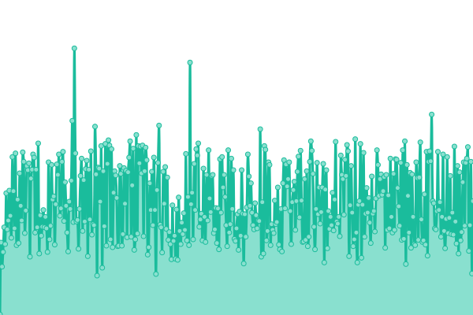 229ms</summary><br><a href="https://Certegy-Payment-Solutions.github.io/upptime/history/core-web-service-soap-v1-cce"></a><br><a href="https://Certegy-Payment-Solutions.github.io/upptime/history/core-web-service-soap-v1-cce"></a><br><a href="https://Certegy-Payment-Solutions.github.io/upptime/history/core-web-service-soap-v1-cce"></a><br><a href="https://Certegy-Payment-Solutions.github.io/upptime/history/core-web-service-soap-v1-cce"></a><br><a href="https://Certegy-Payment-Solutions.github.io/upptime/history/core-web-service-soap-v1-cce"></a></details> | <details><summary><a href="https://Certegy-Payment-Solutions.github.io/upptime/history/core-web-service-soap-v1-cce">0.00%</a></summary><a href="https://Certegy-Payment-Solutions.github.io/upptime/history/core-web-service-soap-v1-cce"></a><br><a href="https://Certegy-Payment-Solutions.github.io/upptime/history/core-web-service-soap-v1-cce"></a><br><a href="https://Certegy-Payment-Solutions.github.io/upptime/history/core-web-service-soap-v1-cce"></a><br><a href="https://Certegy-Payment-Solutions.github.io/upptime/history/core-web-service-soap-v1-cce"></a><br><a href="https://Certegy-Payment-Solutions.github.io/upptime/history/core-web-service-soap-v1-cce"></a></details>
|  [CoreWebService (SOAP V1) - PROD](https://soap-retail.certegy.com/v1) | 🟥 Down | [core-web-service-soap-v1-prod.yml](https://github.com/Certegy-Payment-Solutions/upptime/commits/HEAD/history/core-web-service-soap-v1-prod.yml) | <details><summary>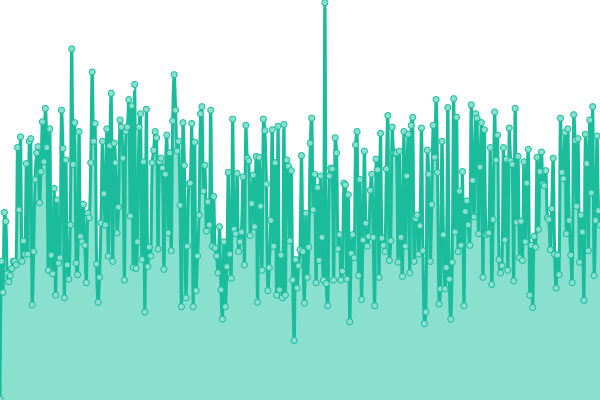 221ms</summary><br><a href="https://Certegy-Payment-Solutions.github.io/upptime/history/core-web-service-soap-v1-prod"></a><br><a href="https://Certegy-Payment-Solutions.github.io/upptime/history/core-web-service-soap-v1-prod"></a><br><a href="https://Certegy-Payment-Solutions.github.io/upptime/history/core-web-service-soap-v1-prod"></a><br><a href="https://Certegy-Payment-Solutions.github.io/upptime/history/core-web-service-soap-v1-prod"></a><br><a href="https://Certegy-Payment-Solutions.github.io/upptime/history/core-web-service-soap-v1-prod"></a></details> | <details><summary><a href="https://Certegy-Payment-Solutions.github.io/upptime/history/core-web-service-soap-v1-prod">0.00%</a></summary><a href="https://Certegy-Payment-Solutions.github.io/upptime/history/core-web-service-soap-v1-prod"></a><br><a href="https://Certegy-Payment-Solutions.github.io/upptime/history/core-web-service-soap-v1-prod"></a><br><a href="https://Certegy-Payment-Solutions.github.io/upptime/history/core-web-service-soap-v1-prod"></a><br><a href="https://Certegy-Payment-Solutions.github.io/upptime/history/core-web-service-soap-v1-prod"></a><br><a href="https://Certegy-Payment-Solutions.github.io/upptime/history/core-web-service-soap-v1-prod"></a></details>
|  [CoreWebService (SOAP V2) - CCE](https://cce-soap-retail.certegy.com/v2) | 🟥 Down | [core-web-service-soap-v2-cce.yml](https://github.com/Certegy-Payment-Solutions/upptime/commits/HEAD/history/core-web-service-soap-v2-cce.yml) | <details><summary>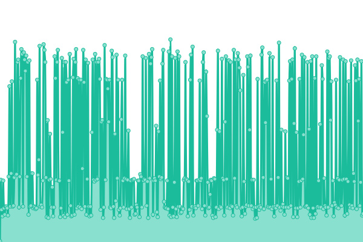 110ms</summary><br><a href="https://Certegy-Payment-Solutions.github.io/upptime/history/core-web-service-soap-v2-cce"></a><br><a href="https://Certegy-Payment-Solutions.github.io/upptime/history/core-web-service-soap-v2-cce"></a><br><a href="https://Certegy-Payment-Solutions.github.io/upptime/history/core-web-service-soap-v2-cce"></a><br><a href="https://Certegy-Payment-Solutions.github.io/upptime/history/core-web-service-soap-v2-cce"></a><br><a href="https://Certegy-Payment-Solutions.github.io/upptime/history/core-web-service-soap-v2-cce"></a></details> | <details><summary><a href="https://Certegy-Payment-Solutions.github.io/upptime/history/core-web-service-soap-v2-cce">0.00%</a></summary><a href="https://Certegy-Payment-Solutions.github.io/upptime/history/core-web-service-soap-v2-cce"></a><br><a href="https://Certegy-Payment-Solutions.github.io/upptime/history/core-web-service-soap-v2-cce"></a><br><a href="https://Certegy-Payment-Solutions.github.io/upptime/history/core-web-service-soap-v2-cce"></a><br><a href="https://Certegy-Payment-Solutions.github.io/upptime/history/core-web-service-soap-v2-cce"></a><br><a href="https://Certegy-Payment-Solutions.github.io/upptime/history/core-web-service-soap-v2-cce"></a></details>
|  [CoreWebService (SOAP V2) - PROD](https://soap-retail.certegy.com/v2) | 🟥 Down | [core-web-service-soap-v2-prod.yml](https://github.com/Certegy-Payment-Solutions/upptime/commits/HEAD/history/core-web-service-soap-v2-prod.yml) | <details><summary>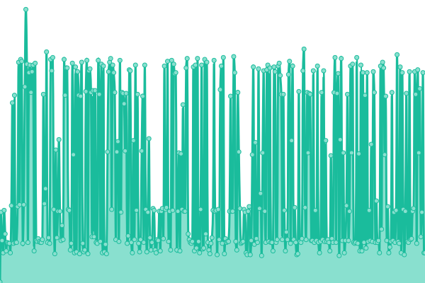 115ms</summary><br><a href="https://Certegy-Payment-Solutions.github.io/upptime/history/core-web-service-soap-v2-prod"></a><br><a href="https://Certegy-Payment-Solutions.github.io/upptime/history/core-web-service-soap-v2-prod"></a><br><a href="https://Certegy-Payment-Solutions.github.io/upptime/history/core-web-service-soap-v2-prod"></a><br><a href="https://Certegy-Payment-Solutions.github.io/upptime/history/core-web-service-soap-v2-prod"></a><br><a href="https://Certegy-Payment-Solutions.github.io/upptime/history/core-web-service-soap-v2-prod"></a></details> | <details><summary><a href="https://Certegy-Payment-Solutions.github.io/upptime/history/core-web-service-soap-v2-prod">0.00%</a></summary><a href="https://Certegy-Payment-Solutions.github.io/upptime/history/core-web-service-soap-v2-prod"></a><br><a href="https://Certegy-Payment-Solutions.github.io/upptime/history/core-web-service-soap-v2-prod"></a><br><a href="https://Certegy-Payment-Solutions.github.io/upptime/history/core-web-service-soap-v2-prod"></a><br><a href="https://Certegy-Payment-Solutions.github.io/upptime/history/core-web-service-soap-v2-prod"></a><br><a href="https://Certegy-Payment-Solutions.github.io/upptime/history/core-web-service-soap-v2-prod"></a></details>
|  [PCAWebService (SOAP) - CCE](https://cce-soap-ccd.certegy.com/v1) | 🟥 Down | [pca-web-service-soap-cce.yml](https://github.com/Certegy-Payment-Solutions/upptime/commits/HEAD/history/pca-web-service-soap-cce.yml) | <details><summary>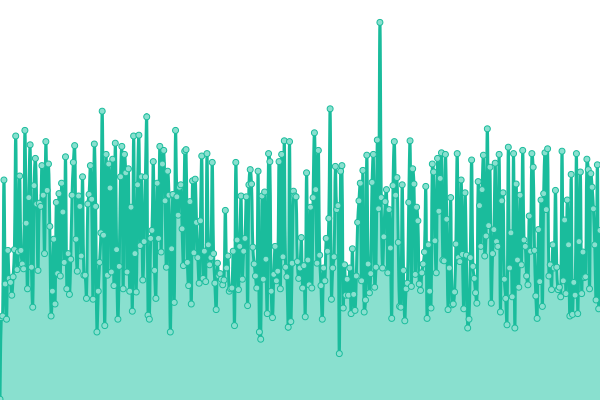 206ms</summary><br><a href="https://Certegy-Payment-Solutions.github.io/upptime/history/pca-web-service-soap-cce"></a><br><a href="https://Certegy-Payment-Solutions.github.io/upptime/history/pca-web-service-soap-cce"></a><br><a href="https://Certegy-Payment-Solutions.github.io/upptime/history/pca-web-service-soap-cce"></a><br><a href="https://Certegy-Payment-Solutions.github.io/upptime/history/pca-web-service-soap-cce"></a><br><a href="https://Certegy-Payment-Solutions.github.io/upptime/history/pca-web-service-soap-cce"></a></details> | <details><summary><a href="https://Certegy-Payment-Solutions.github.io/upptime/history/pca-web-service-soap-cce">0.00%</a></summary><a href="https://Certegy-Payment-Solutions.github.io/upptime/history/pca-web-service-soap-cce"></a><br><a href="https://Certegy-Payment-Solutions.github.io/upptime/history/pca-web-service-soap-cce"></a><br><a href="https://Certegy-Payment-Solutions.github.io/upptime/history/pca-web-service-soap-cce"></a><br><a href="https://Certegy-Payment-Solutions.github.io/upptime/history/pca-web-service-soap-cce"></a><br><a href="https://Certegy-Payment-Solutions.github.io/upptime/history/pca-web-service-soap-cce"></a></details>
|  [PCAWebService (SOAP) - PROD](https://soap-ccd.certegy.com/v1) | 🟥 Down | [pca-web-service-soap-prod.yml](https://github.com/Certegy-Payment-Solutions/upptime/commits/HEAD/history/pca-web-service-soap-prod.yml) | <details><summary>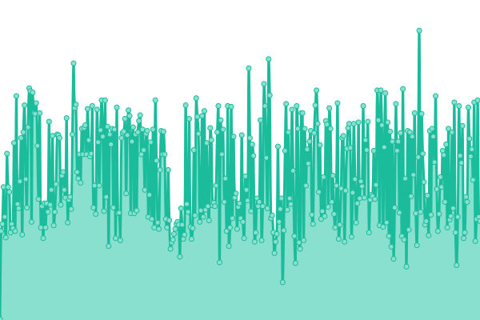 207ms</summary><br><a href="https://Certegy-Payment-Solutions.github.io/upptime/history/pca-web-service-soap-prod"></a><br><a href="https://Certegy-Payment-Solutions.github.io/upptime/history/pca-web-service-soap-prod"></a><br><a href="https://Certegy-Payment-Solutions.github.io/upptime/history/pca-web-service-soap-prod"></a><br><a href="https://Certegy-Payment-Solutions.github.io/upptime/history/pca-web-service-soap-prod"></a><br><a href="https://Certegy-Payment-Solutions.github.io/upptime/history/pca-web-service-soap-prod"></a></details> | <details><summary><a href="https://Certegy-Payment-Solutions.github.io/upptime/history/pca-web-service-soap-prod">0.00%</a></summary><a href="https://Certegy-Payment-Solutions.github.io/upptime/history/pca-web-service-soap-prod"></a><br><a href="https://Certegy-Payment-Solutions.github.io/upptime/history/pca-web-service-soap-prod"></a><br><a href="https://Certegy-Payment-Solutions.github.io/upptime/history/pca-web-service-soap-prod"></a><br><a href="https://Certegy-Payment-Solutions.github.io/upptime/history/pca-web-service-soap-prod"></a><br><a href="https://Certegy-Payment-Solutions.github.io/upptime/history/pca-web-service-soap-prod"></a></details>
|  [MICR_parser (SOAP) - CCE](https://cce-soap-micr-parser.certegy.com/v1) | 🟥 Down | [micr-parser-soap-cce.yml](https://github.com/Certegy-Payment-Solutions/upptime/commits/HEAD/history/micr-parser-soap-cce.yml) | <details><summary>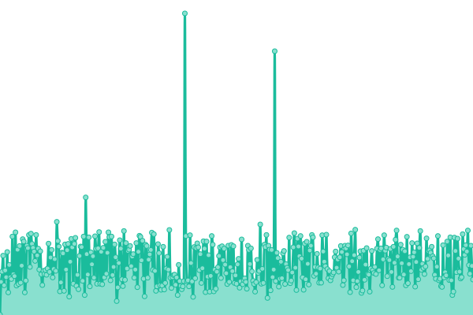 202ms</summary><br><a href="https://Certegy-Payment-Solutions.github.io/upptime/history/micr-parser-soap-cce"></a><br><a href="https://Certegy-Payment-Solutions.github.io/upptime/history/micr-parser-soap-cce"></a><br><a href="https://Certegy-Payment-Solutions.github.io/upptime/history/micr-parser-soap-cce"></a><br><a href="https://Certegy-Payment-Solutions.github.io/upptime/history/micr-parser-soap-cce"></a><br><a href="https://Certegy-Payment-Solutions.github.io/upptime/history/micr-parser-soap-cce"></a></details> | <details><summary><a href="https://Certegy-Payment-Solutions.github.io/upptime/history/micr-parser-soap-cce">0.00%</a></summary><a href="https://Certegy-Payment-Solutions.github.io/upptime/history/micr-parser-soap-cce"></a><br><a href="https://Certegy-Payment-Solutions.github.io/upptime/history/micr-parser-soap-cce"></a><br><a href="https://Certegy-Payment-Solutions.github.io/upptime/history/micr-parser-soap-cce"></a><br><a href="https://Certegy-Payment-Solutions.github.io/upptime/history/micr-parser-soap-cce"></a><br><a href="https://Certegy-Payment-Solutions.github.io/upptime/history/micr-parser-soap-cce"></a></details>
|  [MICR_parser (SOAP) - PROD](https://soap-micr-parser.certegy.com/v1) | 🟥 Down | [micr-parser-soap-prod.yml](https://github.com/Certegy-Payment-Solutions/upptime/commits/HEAD/history/micr-parser-soap-prod.yml) | <details><summary> 209ms</summary><br><a href="https://Certegy-Payment-Solutions.github.io/upptime/history/micr-parser-soap-prod"></a><br><a href="https://Certegy-Payment-Solutions.github.io/upptime/history/micr-parser-soap-prod"></a><br><a href="https://Certegy-Payment-Solutions.github.io/upptime/history/micr-parser-soap-prod"></a><br><a href="https://Certegy-Payment-Solutions.github.io/upptime/history/micr-parser-soap-prod"></a><br><a href="https://Certegy-Payment-Solutions.github.io/upptime/history/micr-parser-soap-prod"></a></details> | <details><summary><a href="https://Certegy-Payment-Solutions.github.io/upptime/history/micr-parser-soap-prod">0.00%</a></summary><a href="https://Certegy-Payment-Solutions.github.io/upptime/history/micr-parser-soap-prod"></a><br><a href="https://Certegy-Payment-Solutions.github.io/upptime/history/micr-parser-soap-prod"></a><br><a href="https://Certegy-Payment-Solutions.github.io/upptime/history/micr-parser-soap-prod"></a><br><a href="https://Certegy-Payment-Solutions.github.io/upptime/history/micr-parser-soap-prod"></a><br><a href="https://Certegy-Payment-Solutions.github.io/upptime/history/micr-parser-soap-prod"></a></details>
|  [POSIPGateway Service (HTTPS) - CCE](https://cce-pos-ip-gateway.certegy.com/v1) | 🟥 Down | [posip-gateway-service-https-cce.yml](https://github.com/Certegy-Payment-Solutions/upptime/commits/HEAD/history/posip-gateway-service-https-cce.yml) | <details><summary>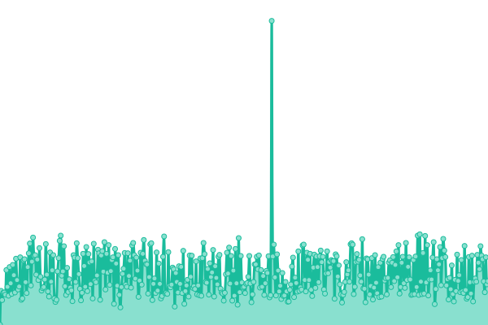 191ms</summary><br><a href="https://Certegy-Payment-Solutions.github.io/upptime/history/posip-gateway-service-https-cce"></a><br><a href="https://Certegy-Payment-Solutions.github.io/upptime/history/posip-gateway-service-https-cce"></a><br><a href="https://Certegy-Payment-Solutions.github.io/upptime/history/posip-gateway-service-https-cce"></a><br><a href="https://Certegy-Payment-Solutions.github.io/upptime/history/posip-gateway-service-https-cce"></a><br><a href="https://Certegy-Payment-Solutions.github.io/upptime/history/posip-gateway-service-https-cce"></a></details> | <details><summary><a href="https://Certegy-Payment-Solutions.github.io/upptime/history/posip-gateway-service-https-cce">0.00%</a></summary><a href="https://Certegy-Payment-Solutions.github.io/upptime/history/posip-gateway-service-https-cce"></a><br><a href="https://Certegy-Payment-Solutions.github.io/upptime/history/posip-gateway-service-https-cce"></a><br><a href="https://Certegy-Payment-Solutions.github.io/upptime/history/posip-gateway-service-https-cce"></a><br><a href="https://Certegy-Payment-Solutions.github.io/upptime/history/posip-gateway-service-https-cce"></a><br><a href="https://Certegy-Payment-Solutions.github.io/upptime/history/posip-gateway-service-https-cce"></a></details>
|  [POSIPGateway Service (HTTPS) - PROD](https://pos-ip-gateway.certegy.com/v1) | 🟥 Down | [posip-gateway-service-https-prod.yml](https://github.com/Certegy-Payment-Solutions/upptime/commits/HEAD/history/posip-gateway-service-https-prod.yml) | <details><summary>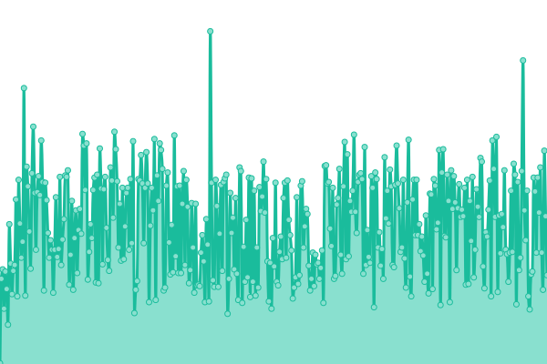 197ms</summary><br><a href="https://Certegy-Payment-Solutions.github.io/upptime/history/posip-gateway-service-https-prod"></a><br><a href="https://Certegy-Payment-Solutions.github.io/upptime/history/posip-gateway-service-https-prod"></a><br><a href="https://Certegy-Payment-Solutions.github.io/upptime/history/posip-gateway-service-https-prod"></a><br><a href="https://Certegy-Payment-Solutions.github.io/upptime/history/posip-gateway-service-https-prod"></a><br><a href="https://Certegy-Payment-Solutions.github.io/upptime/history/posip-gateway-service-https-prod"></a></details> | <details><summary><a href="https://Certegy-Payment-Solutions.github.io/upptime/history/posip-gateway-service-https-prod">0.00%</a></summary><a href="https://Certegy-Payment-Solutions.github.io/upptime/history/posip-gateway-service-https-prod"></a><br><a href="https://Certegy-Payment-Solutions.github.io/upptime/history/posip-gateway-service-https-prod"></a><br><a href="https://Certegy-Payment-Solutions.github.io/upptime/history/posip-gateway-service-https-prod"></a><br><a href="https://Certegy-Payment-Solutions.github.io/upptime/history/posip-gateway-service-https-prod"></a><br><a href="https://Certegy-Payment-Solutions.github.io/upptime/history/posip-gateway-service-https-prod"></a></details>
|  [ReqEServiceSoap (SOAP) - CCE](https://cce-soap-rege.certegy.com/v1) | 🟥 Down | [req-e-service-soap-soap-cce.yml](https://github.com/Certegy-Payment-Solutions/upptime/commits/HEAD/history/req-e-service-soap-soap-cce.yml) | <details><summary>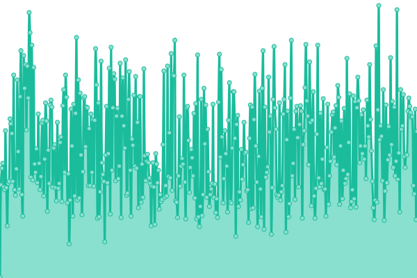 191ms</summary><br><a href="https://Certegy-Payment-Solutions.github.io/upptime/history/req-e-service-soap-soap-cce"></a><br><a href="https://Certegy-Payment-Solutions.github.io/upptime/history/req-e-service-soap-soap-cce"></a><br><a href="https://Certegy-Payment-Solutions.github.io/upptime/history/req-e-service-soap-soap-cce"></a><br><a href="https://Certegy-Payment-Solutions.github.io/upptime/history/req-e-service-soap-soap-cce"></a><br><a href="https://Certegy-Payment-Solutions.github.io/upptime/history/req-e-service-soap-soap-cce"></a></details> | <details><summary><a href="https://Certegy-Payment-Solutions.github.io/upptime/history/req-e-service-soap-soap-cce">0.00%</a></summary><a href="https://Certegy-Payment-Solutions.github.io/upptime/history/req-e-service-soap-soap-cce"></a><br><a href="https://Certegy-Payment-Solutions.github.io/upptime/history/req-e-service-soap-soap-cce"></a><br><a href="https://Certegy-Payment-Solutions.github.io/upptime/history/req-e-service-soap-soap-cce"></a><br><a href="https://Certegy-Payment-Solutions.github.io/upptime/history/req-e-service-soap-soap-cce"></a><br><a href="https://Certegy-Payment-Solutions.github.io/upptime/history/req-e-service-soap-soap-cce"></a></details>
|  [ReqEServiceSoap (SOAP) - PROD](https://soap-reqe.certegy.com/v1) | 🟥 Down | [req-e-service-soap-soap-prod.yml](https://github.com/Certegy-Payment-Solutions/upptime/commits/HEAD/history/req-e-service-soap-soap-prod.yml) | <details><summary> 0ms</summary><br><a href="https://Certegy-Payment-Solutions.github.io/upptime/history/req-e-service-soap-soap-prod"></a><br><a href="https://Certegy-Payment-Solutions.github.io/upptime/history/req-e-service-soap-soap-prod"></a><br><a href="https://Certegy-Payment-Solutions.github.io/upptime/history/req-e-service-soap-soap-prod"></a><br><a href="https://Certegy-Payment-Solutions.github.io/upptime/history/req-e-service-soap-soap-prod"></a><br><a href="https://Certegy-Payment-Solutions.github.io/upptime/history/req-e-service-soap-soap-prod"></a></details> | <details><summary><a href="https://Certegy-Payment-Solutions.github.io/upptime/history/req-e-service-soap-soap-prod">0.00%</a></summary><a href="https://Certegy-Payment-Solutions.github.io/upptime/history/req-e-service-soap-soap-prod"></a><br><a href="https://Certegy-Payment-Solutions.github.io/upptime/history/req-e-service-soap-soap-prod"></a><br><a href="https://Certegy-Payment-Solutions.github.io/upptime/history/req-e-service-soap-soap-prod"></a><br><a href="https://Certegy-Payment-Solutions.github.io/upptime/history/req-e-service-soap-soap-prod"></a><br><a href="https://Certegy-Payment-Solutions.github.io/upptime/history/req-e-service-soap-soap-prod"></a></details>
|  [PayNetLevel1 - CCE](https://cce-paynet.certegy.com/PayNet/) | 🟥 Down | [pay-net-level1-cce.yml](https://github.com/Certegy-Payment-Solutions/upptime/commits/HEAD/history/pay-net-level1-cce.yml) | <details><summary>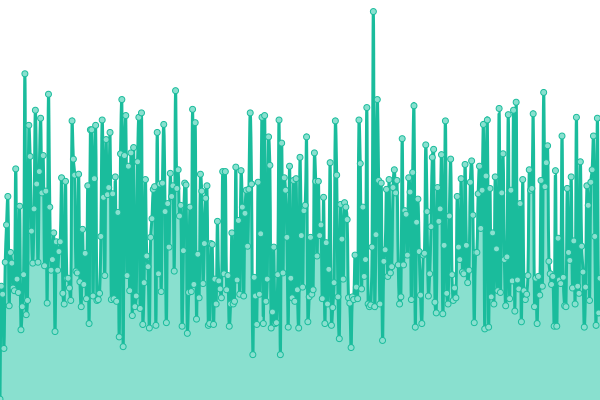 186ms</summary><br><a href="https://Certegy-Payment-Solutions.github.io/upptime/history/pay-net-level1-cce"></a><br><a href="https://Certegy-Payment-Solutions.github.io/upptime/history/pay-net-level1-cce"></a><br><a href="https://Certegy-Payment-Solutions.github.io/upptime/history/pay-net-level1-cce"></a><br><a href="https://Certegy-Payment-Solutions.github.io/upptime/history/pay-net-level1-cce"></a><br><a href="https://Certegy-Payment-Solutions.github.io/upptime/history/pay-net-level1-cce"></a></details> | <details><summary><a href="https://Certegy-Payment-Solutions.github.io/upptime/history/pay-net-level1-cce">0.00%</a></summary><a href="https://Certegy-Payment-Solutions.github.io/upptime/history/pay-net-level1-cce"></a><br><a href="https://Certegy-Payment-Solutions.github.io/upptime/history/pay-net-level1-cce"></a><br><a href="https://Certegy-Payment-Solutions.github.io/upptime/history/pay-net-level1-cce"></a><br><a href="https://Certegy-Payment-Solutions.github.io/upptime/history/pay-net-level1-cce"></a><br><a href="https://Certegy-Payment-Solutions.github.io/upptime/history/pay-net-level1-cce"></a></details>
|  [PayNetLevel1 - PROD](https://paynet.certegy.com/PayNet/) | 🟥 Down | [pay-net-level1-prod.yml](https://github.com/Certegy-Payment-Solutions/upptime/commits/HEAD/history/pay-net-level1-prod.yml) | <details><summary>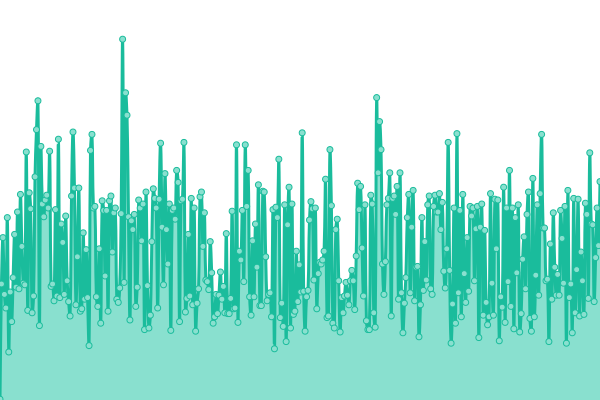 186ms</summary><br><a href="https://Certegy-Payment-Solutions.github.io/upptime/history/pay-net-level1-prod"></a><br><a href="https://Certegy-Payment-Solutions.github.io/upptime/history/pay-net-level1-prod"></a><br><a href="https://Certegy-Payment-Solutions.github.io/upptime/history/pay-net-level1-prod"></a><br><a href="https://Certegy-Payment-Solutions.github.io/upptime/history/pay-net-level1-prod"></a><br><a href="https://Certegy-Payment-Solutions.github.io/upptime/history/pay-net-level1-prod"></a></details> | <details><summary><a href="https://Certegy-Payment-Solutions.github.io/upptime/history/pay-net-level1-prod">0.00%</a></summary><a href="https://Certegy-Payment-Solutions.github.io/upptime/history/pay-net-level1-prod"></a><br><a href="https://Certegy-Payment-Solutions.github.io/upptime/history/pay-net-level1-prod"></a><br><a href="https://Certegy-Payment-Solutions.github.io/upptime/history/pay-net-level1-prod"></a><br><a href="https://Certegy-Payment-Solutions.github.io/upptime/history/pay-net-level1-prod"></a><br><a href="https://Certegy-Payment-Solutions.github.io/upptime/history/pay-net-level1-prod"></a></details>
|  [PaynetMerchant - CCE](https://cce-merchant-app.certegy.com/portal-app/) | 🟩 Up | [paynet-merchant-cce.yml](https://github.com/Certegy-Payment-Solutions/upptime/commits/HEAD/history/paynet-merchant-cce.yml) | <details><summary> 215ms</summary><br><a href="https://Certegy-Payment-Solutions.github.io/upptime/history/paynet-merchant-cce"></a><br><a href="https://Certegy-Payment-Solutions.github.io/upptime/history/paynet-merchant-cce"></a><br><a href="https://Certegy-Payment-Solutions.github.io/upptime/history/paynet-merchant-cce"></a><br><a href="https://Certegy-Payment-Solutions.github.io/upptime/history/paynet-merchant-cce"></a><br><a href="https://Certegy-Payment-Solutions.github.io/upptime/history/paynet-merchant-cce"></a></details> | <details><summary><a href="https://Certegy-Payment-Solutions.github.io/upptime/history/paynet-merchant-cce">0.00%</a></summary><a href="https://Certegy-Payment-Solutions.github.io/upptime/history/paynet-merchant-cce"></a><br><a href="https://Certegy-Payment-Solutions.github.io/upptime/history/paynet-merchant-cce"></a><br><a href="https://Certegy-Payment-Solutions.github.io/upptime/history/paynet-merchant-cce"></a><br><a href="https://Certegy-Payment-Solutions.github.io/upptime/history/paynet-merchant-cce"></a><br><a href="https://Certegy-Payment-Solutions.github.io/upptime/history/paynet-merchant-cce"></a></details>
|  [PaynetMerchant - PROD](https://merchant-app.certegy.com/portal-app/) | 🟩 Up | [paynet-merchant-prod.yml](https://github.com/Certegy-Payment-Solutions/upptime/commits/HEAD/history/paynet-merchant-prod.yml) | <details><summary>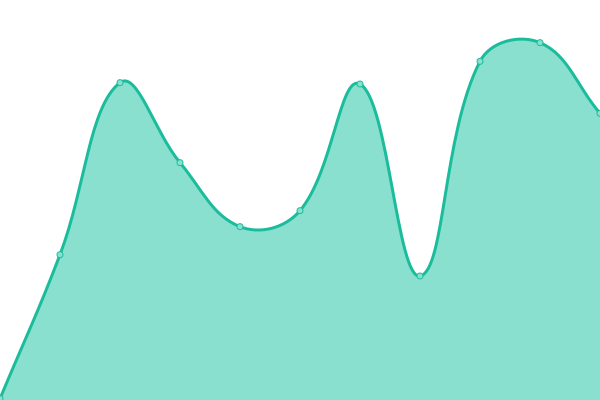 193ms</summary><br><a href="https://Certegy-Payment-Solutions.github.io/upptime/history/paynet-merchant-prod"></a><br><a href="https://Certegy-Payment-Solutions.github.io/upptime/history/paynet-merchant-prod"></a><br><a href="https://Certegy-Payment-Solutions.github.io/upptime/history/paynet-merchant-prod"></a><br><a href="https://Certegy-Payment-Solutions.github.io/upptime/history/paynet-merchant-prod"></a><br><a href="https://Certegy-Payment-Solutions.github.io/upptime/history/paynet-merchant-prod"></a></details> | <details><summary><a href="https://Certegy-Payment-Solutions.github.io/upptime/history/paynet-merchant-prod">8.90%</a></summary><a href="https://Certegy-Payment-Solutions.github.io/upptime/history/paynet-merchant-prod"></a><br><a href="https://Certegy-Payment-Solutions.github.io/upptime/history/paynet-merchant-prod"></a><br><a href="https://Certegy-Payment-Solutions.github.io/upptime/history/paynet-merchant-prod"></a><br><a href="https://Certegy-Payment-Solutions.github.io/upptime/history/paynet-merchant-prod"></a><br><a href="https://Certegy-Payment-Solutions.github.io/upptime/history/paynet-merchant-prod"></a></details>
|  [kftool-certegy - CCE](https://cce-kftool.certegy.com/kftool-certegy/) | 🟩 Up | [kftool-certegy-cce.yml](https://github.com/Certegy-Payment-Solutions/upptime/commits/HEAD/history/kftool-certegy-cce.yml) | <details><summary>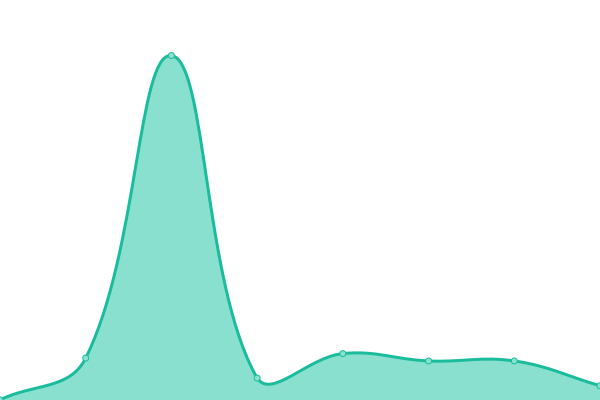 488ms</summary><br><a href="https://Certegy-Payment-Solutions.github.io/upptime/history/kftool-certegy-cce"></a><br><a href="https://Certegy-Payment-Solutions.github.io/upptime/history/kftool-certegy-cce"></a><br><a href="https://Certegy-Payment-Solutions.github.io/upptime/history/kftool-certegy-cce"></a><br><a href="https://Certegy-Payment-Solutions.github.io/upptime/history/kftool-certegy-cce"></a><br><a href="https://Certegy-Payment-Solutions.github.io/upptime/history/kftool-certegy-cce"></a></details> | <details><summary><a href="https://Certegy-Payment-Solutions.github.io/upptime/history/kftool-certegy-cce">0.00%</a></summary><a href="https://Certegy-Payment-Solutions.github.io/upptime/history/kftool-certegy-cce"></a><br><a href="https://Certegy-Payment-Solutions.github.io/upptime/history/kftool-certegy-cce"></a><br><a href="https://Certegy-Payment-Solutions.github.io/upptime/history/kftool-certegy-cce"></a><br><a href="https://Certegy-Payment-Solutions.github.io/upptime/history/kftool-certegy-cce"></a><br><a href="https://Certegy-Payment-Solutions.github.io/upptime/history/kftool-certegy-cce"></a></details>
|  [kftool-certegy - PROD](https://kftool.certegy.com/kftool-certegy/) | 🟩 Up | [kftool-certegy-prod.yml](https://github.com/Certegy-Payment-Solutions/upptime/commits/HEAD/history/kftool-certegy-prod.yml) | <details><summary>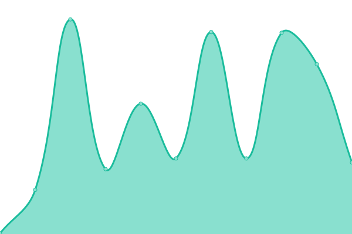 191ms</summary><br><a href="https://Certegy-Payment-Solutions.github.io/upptime/history/kftool-certegy-prod"></a><br><a href="https://Certegy-Payment-Solutions.github.io/upptime/history/kftool-certegy-prod"></a><br><a href="https://Certegy-Payment-Solutions.github.io/upptime/history/kftool-certegy-prod"></a><br><a href="https://Certegy-Payment-Solutions.github.io/upptime/history/kftool-certegy-prod"></a><br><a href="https://Certegy-Payment-Solutions.github.io/upptime/history/kftool-certegy-prod"></a></details> | <details><summary><a href="https://Certegy-Payment-Solutions.github.io/upptime/history/kftool-certegy-prod">8.96%</a></summary><a href="https://Certegy-Payment-Solutions.github.io/upptime/history/kftool-certegy-prod"></a><br><a href="https://Certegy-Payment-Solutions.github.io/upptime/history/kftool-certegy-prod"></a><br><a href="https://Certegy-Payment-Solutions.github.io/upptime/history/kftool-certegy-prod"></a><br><a href="https://Certegy-Payment-Solutions.github.io/upptime/history/kftool-certegy-prod"></a><br><a href="https://Certegy-Payment-Solutions.github.io/upptime/history/kftool-certegy-prod"></a></details>
|  [Edoc - CCE](https://cce-edoc.certegy.com) | 🟥 Down | [edoc-cce.yml](https://github.com/Certegy-Payment-Solutions/upptime/commits/HEAD/history/edoc-cce.yml) | <details><summary>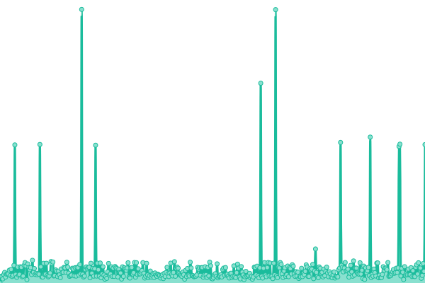 236ms</summary><br><a href="https://Certegy-Payment-Solutions.github.io/upptime/history/edoc-cce"></a><br><a href="https://Certegy-Payment-Solutions.github.io/upptime/history/edoc-cce"></a><br><a href="https://Certegy-Payment-Solutions.github.io/upptime/history/edoc-cce"></a><br><a href="https://Certegy-Payment-Solutions.github.io/upptime/history/edoc-cce"></a><br><a href="https://Certegy-Payment-Solutions.github.io/upptime/history/edoc-cce"></a></details> | <details><summary><a href="https://Certegy-Payment-Solutions.github.io/upptime/history/edoc-cce">0.00%</a></summary><a href="https://Certegy-Payment-Solutions.github.io/upptime/history/edoc-cce"></a><br><a href="https://Certegy-Payment-Solutions.github.io/upptime/history/edoc-cce"></a><br><a href="https://Certegy-Payment-Solutions.github.io/upptime/history/edoc-cce"></a><br><a href="https://Certegy-Payment-Solutions.github.io/upptime/history/edoc-cce"></a><br><a href="https://Certegy-Payment-Solutions.github.io/upptime/history/edoc-cce"></a></details>
|  [Edoc - PROD](https://edoc.certegy.com) | 🟥 Down | [edoc-prod.yml](https://github.com/Certegy-Payment-Solutions/upptime/commits/HEAD/history/edoc-prod.yml) | <details><summary>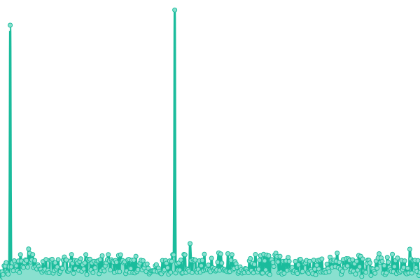 189ms</summary><br><a href="https://Certegy-Payment-Solutions.github.io/upptime/history/edoc-prod"></a><br><a href="https://Certegy-Payment-Solutions.github.io/upptime/history/edoc-prod"></a><br><a href="https://Certegy-Payment-Solutions.github.io/upptime/history/edoc-prod"></a><br><a href="https://Certegy-Payment-Solutions.github.io/upptime/history/edoc-prod"></a><br><a href="https://Certegy-Payment-Solutions.github.io/upptime/history/edoc-prod"></a></details> | <details><summary><a href="https://Certegy-Payment-Solutions.github.io/upptime/history/edoc-prod">0.00%</a></summary><a href="https://Certegy-Payment-Solutions.github.io/upptime/history/edoc-prod"></a><br><a href="https://Certegy-Payment-Solutions.github.io/upptime/history/edoc-prod"></a><br><a href="https://Certegy-Payment-Solutions.github.io/upptime/history/edoc-prod"></a><br><a href="https://Certegy-Payment-Solutions.github.io/upptime/history/edoc-prod"></a><br><a href="https://Certegy-Payment-Solutions.github.io/upptime/history/edoc-prod"></a></details>
|  [ask-certegy - CCE](https://cce.askcertegy.com) | 🟩 Up | [ask-certegy-cce.yml](https://github.com/Certegy-Payment-Solutions/upptime/commits/HEAD/history/ask-certegy-cce.yml) | <details><summary> 277ms</summary><br><a href="https://Certegy-Payment-Solutions.github.io/upptime/history/ask-certegy-cce"></a><br><a href="https://Certegy-Payment-Solutions.github.io/upptime/history/ask-certegy-cce"></a><br><a href="https://Certegy-Payment-Solutions.github.io/upptime/history/ask-certegy-cce"></a><br><a href="https://Certegy-Payment-Solutions.github.io/upptime/history/ask-certegy-cce"></a><br><a href="https://Certegy-Payment-Solutions.github.io/upptime/history/ask-certegy-cce"></a></details> | <details><summary><a href="https://Certegy-Payment-Solutions.github.io/upptime/history/ask-certegy-cce">100.00%</a></summary><a href="https://Certegy-Payment-Solutions.github.io/upptime/history/ask-certegy-cce"></a><br><a href="https://Certegy-Payment-Solutions.github.io/upptime/history/ask-certegy-cce"></a><br><a href="https://Certegy-Payment-Solutions.github.io/upptime/history/ask-certegy-cce"></a><br><a href="https://Certegy-Payment-Solutions.github.io/upptime/history/ask-certegy-cce"></a><br><a href="https://Certegy-Payment-Solutions.github.io/upptime/history/ask-certegy-cce"></a></details>
|  [ask-certegy - PROD](https://askcertegy.com) | 🟩 Up | [ask-certegy-prod.yml](https://github.com/Certegy-Payment-Solutions/upptime/commits/HEAD/history/ask-certegy-prod.yml) | <details><summary>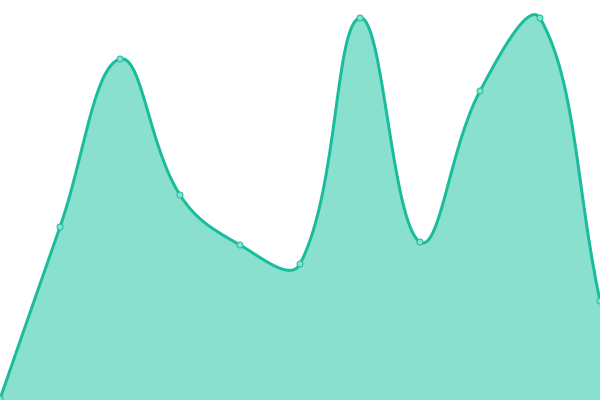 237ms</summary><br><a href="https://Certegy-Payment-Solutions.github.io/upptime/history/ask-certegy-prod"></a><br><a href="https://Certegy-Payment-Solutions.github.io/upptime/history/ask-certegy-prod"></a><br><a href="https://Certegy-Payment-Solutions.github.io/upptime/history/ask-certegy-prod"></a><br><a href="https://Certegy-Payment-Solutions.github.io/upptime/history/ask-certegy-prod"></a><br><a href="https://Certegy-Payment-Solutions.github.io/upptime/history/ask-certegy-prod"></a></details> | <details><summary><a href="https://Certegy-Payment-Solutions.github.io/upptime/history/ask-certegy-prod">9.09%</a></summary><a href="https://Certegy-Payment-Solutions.github.io/upptime/history/ask-certegy-prod"></a><br><a href="https://Certegy-Payment-Solutions.github.io/upptime/history/ask-certegy-prod"></a><br><a href="https://Certegy-Payment-Solutions.github.io/upptime/history/ask-certegy-prod"></a><br><a href="https://Certegy-Payment-Solutions.github.io/upptime/history/ask-certegy-prod"></a><br><a href="https://Certegy-Payment-Solutions.github.io/upptime/history/ask-certegy-prod"></a></details>
|  [Consumer Portal - PROD](https://dashboard.certegy.com) | 🟩 Up | [consumer-portal-prod.yml](https://github.com/Certegy-Payment-Solutions/upptime/commits/HEAD/history/consumer-portal-prod.yml) | <details><summary> 247ms</summary><br><a href="https://Certegy-Payment-Solutions.github.io/upptime/history/consumer-portal-prod"></a><br><a href="https://Certegy-Payment-Solutions.github.io/upptime/history/consumer-portal-prod"></a><br><a href="https://Certegy-Payment-Solutions.github.io/upptime/history/consumer-portal-prod"></a><br><a href="https://Certegy-Payment-Solutions.github.io/upptime/history/consumer-portal-prod"></a><br><a href="https://Certegy-Payment-Solutions.github.io/upptime/history/consumer-portal-prod"></a></details> | <details><summary><a href="https://Certegy-Payment-Solutions.github.io/upptime/history/consumer-portal-prod">100.00%</a></summary><a href="https://Certegy-Payment-Solutions.github.io/upptime/history/consumer-portal-prod"></a><br><a href="https://Certegy-Payment-Solutions.github.io/upptime/history/consumer-portal-prod"></a><br><a href="https://Certegy-Payment-Solutions.github.io/upptime/history/consumer-portal-prod"></a><br><a href="https://Certegy-Payment-Solutions.github.io/upptime/history/consumer-portal-prod"></a><br><a href="https://Certegy-Payment-Solutions.github.io/upptime/history/consumer-portal-prod"></a></details>
|  [CoreWebService (JSON) - CCE](https://cce.retail.certegy.com/v1) | 🟥 Down | [core-web-service-json-cce.yml](https://github.com/Certegy-Payment-Solutions/upptime/commits/HEAD/history/core-web-service-json-cce.yml) | <details><summary>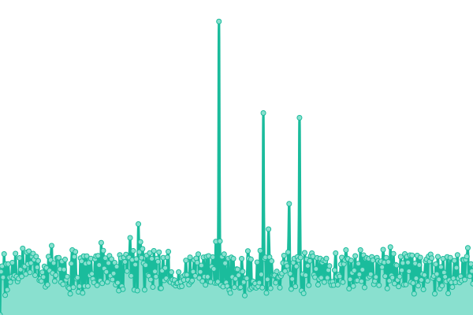 235ms</summary><br><a href="https://Certegy-Payment-Solutions.github.io/upptime/history/core-web-service-json-cce"></a><br><a href="https://Certegy-Payment-Solutions.github.io/upptime/history/core-web-service-json-cce"></a><br><a href="https://Certegy-Payment-Solutions.github.io/upptime/history/core-web-service-json-cce"></a><br><a href="https://Certegy-Payment-Solutions.github.io/upptime/history/core-web-service-json-cce"></a><br><a href="https://Certegy-Payment-Solutions.github.io/upptime/history/core-web-service-json-cce"></a></details> | <details><summary><a href="https://Certegy-Payment-Solutions.github.io/upptime/history/core-web-service-json-cce">0.00%</a></summary><a href="https://Certegy-Payment-Solutions.github.io/upptime/history/core-web-service-json-cce"></a><br><a href="https://Certegy-Payment-Solutions.github.io/upptime/history/core-web-service-json-cce"></a><br><a href="https://Certegy-Payment-Solutions.github.io/upptime/history/core-web-service-json-cce"></a><br><a href="https://Certegy-Payment-Solutions.github.io/upptime/history/core-web-service-json-cce"></a><br><a href="https://Certegy-Payment-Solutions.github.io/upptime/history/core-web-service-json-cce"></a></details>
|  [CoreWebService (JSON) - PROD](https://retail.certegy.com/v1) | 🟥 Down | [core-web-service-json-prod.yml](https://github.com/Certegy-Payment-Solutions/upptime/commits/HEAD/history/core-web-service-json-prod.yml) | <details><summary>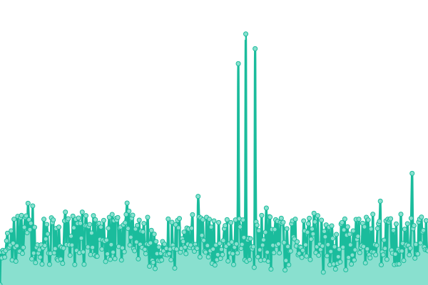 197ms</summary><br><a href="https://Certegy-Payment-Solutions.github.io/upptime/history/core-web-service-json-prod"></a><br><a href="https://Certegy-Payment-Solutions.github.io/upptime/history/core-web-service-json-prod"></a><br><a href="https://Certegy-Payment-Solutions.github.io/upptime/history/core-web-service-json-prod"></a><br><a href="https://Certegy-Payment-Solutions.github.io/upptime/history/core-web-service-json-prod"></a><br><a href="https://Certegy-Payment-Solutions.github.io/upptime/history/core-web-service-json-prod"></a></details> | <details><summary><a href="https://Certegy-Payment-Solutions.github.io/upptime/history/core-web-service-json-prod">0.00%</a></summary><a href="https://Certegy-Payment-Solutions.github.io/upptime/history/core-web-service-json-prod"></a><br><a href="https://Certegy-Payment-Solutions.github.io/upptime/history/core-web-service-json-prod"></a><br><a href="https://Certegy-Payment-Solutions.github.io/upptime/history/core-web-service-json-prod"></a><br><a href="https://Certegy-Payment-Solutions.github.io/upptime/history/core-web-service-json-prod"></a><br><a href="https://Certegy-Payment-Solutions.github.io/upptime/history/core-web-service-json-prod"></a></details>
|  [IVR - CCE](https://cce.ivr.certegy.com/v1/micr-validation) | 🟥 Down | [ivr-cce.yml](https://github.com/Certegy-Payment-Solutions/upptime/commits/HEAD/history/ivr-cce.yml) | <details><summary> 0ms</summary><br><a href="https://Certegy-Payment-Solutions.github.io/upptime/history/ivr-cce"></a><br><a href="https://Certegy-Payment-Solutions.github.io/upptime/history/ivr-cce"></a><br><a href="https://Certegy-Payment-Solutions.github.io/upptime/history/ivr-cce"></a><br><a href="https://Certegy-Payment-Solutions.github.io/upptime/history/ivr-cce"></a><br><a href="https://Certegy-Payment-Solutions.github.io/upptime/history/ivr-cce"></a></details> | <details><summary><a href="https://Certegy-Payment-Solutions.github.io/upptime/history/ivr-cce">0.00%</a></summary><a href="https://Certegy-Payment-Solutions.github.io/upptime/history/ivr-cce"></a><br><a href="https://Certegy-Payment-Solutions.github.io/upptime/history/ivr-cce"></a><br><a href="https://Certegy-Payment-Solutions.github.io/upptime/history/ivr-cce"></a><br><a href="https://Certegy-Payment-Solutions.github.io/upptime/history/ivr-cce"></a><br><a href="https://Certegy-Payment-Solutions.github.io/upptime/history/ivr-cce"></a></details>
|  [IVR - PROD](https://ivr.certegy.com/v1/micr-validation) | 🟥 Down | [ivr-prod.yml](https://github.com/Certegy-Payment-Solutions/upptime/commits/HEAD/history/ivr-prod.yml) | <details><summary>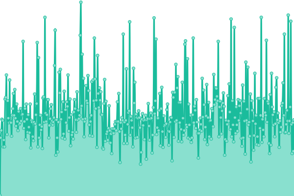 148ms</summary><br><a href="https://Certegy-Payment-Solutions.github.io/upptime/history/ivr-prod"></a><br><a href="https://Certegy-Payment-Solutions.github.io/upptime/history/ivr-prod"></a><br><a href="https://Certegy-Payment-Solutions.github.io/upptime/history/ivr-prod"></a><br><a href="https://Certegy-Payment-Solutions.github.io/upptime/history/ivr-prod"></a><br><a href="https://Certegy-Payment-Solutions.github.io/upptime/history/ivr-prod"></a></details> | <details><summary><a href="https://Certegy-Payment-Solutions.github.io/upptime/history/ivr-prod">0.00%</a></summary><a href="https://Certegy-Payment-Solutions.github.io/upptime/history/ivr-prod"></a><br><a href="https://Certegy-Payment-Solutions.github.io/upptime/history/ivr-prod"></a><br><a href="https://Certegy-Payment-Solutions.github.io/upptime/history/ivr-prod"></a><br><a href="https://Certegy-Payment-Solutions.github.io/upptime/history/ivr-prod"></a><br><a href="https://Certegy-Payment-Solutions.github.io/upptime/history/ivr-prod"></a></details>
|  [Automated Client Onboarding (HTTP) - CCE](https://cce.onboarding.certegy.com/v1) | 🟥 Down | [automated-client-onboarding-http-cce.yml](https://github.com/Certegy-Payment-Solutions/upptime/commits/HEAD/history/automated-client-onboarding-http-cce.yml) | <details><summary>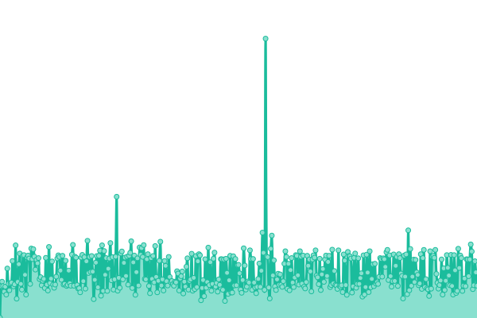 206ms</summary><br><a href="https://Certegy-Payment-Solutions.github.io/upptime/history/automated-client-onboarding-http-cce"></a><br><a href="https://Certegy-Payment-Solutions.github.io/upptime/history/automated-client-onboarding-http-cce"></a><br><a href="https://Certegy-Payment-Solutions.github.io/upptime/history/automated-client-onboarding-http-cce"></a><br><a href="https://Certegy-Payment-Solutions.github.io/upptime/history/automated-client-onboarding-http-cce"></a><br><a href="https://Certegy-Payment-Solutions.github.io/upptime/history/automated-client-onboarding-http-cce"></a></details> | <details><summary><a href="https://Certegy-Payment-Solutions.github.io/upptime/history/automated-client-onboarding-http-cce">0.00%</a></summary><a href="https://Certegy-Payment-Solutions.github.io/upptime/history/automated-client-onboarding-http-cce"></a><br><a href="https://Certegy-Payment-Solutions.github.io/upptime/history/automated-client-onboarding-http-cce"></a><br><a href="https://Certegy-Payment-Solutions.github.io/upptime/history/automated-client-onboarding-http-cce"></a><br><a href="https://Certegy-Payment-Solutions.github.io/upptime/history/automated-client-onboarding-http-cce"></a><br><a href="https://Certegy-Payment-Solutions.github.io/upptime/history/automated-client-onboarding-http-cce"></a></details>
|  [Automated Client Onboarding (HTTP) - PROD](https://onboarding.certegy.com/v1) | 🟥 Down | [automated-client-onboarding-http-prod.yml](https://github.com/Certegy-Payment-Solutions/upptime/commits/HEAD/history/automated-client-onboarding-http-prod.yml) | <details><summary>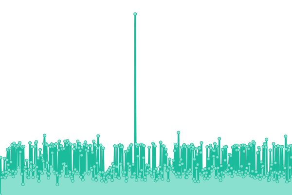 168ms</summary><br><a href="https://Certegy-Payment-Solutions.github.io/upptime/history/automated-client-onboarding-http-prod"></a><br><a href="https://Certegy-Payment-Solutions.github.io/upptime/history/automated-client-onboarding-http-prod"></a><br><a href="https://Certegy-Payment-Solutions.github.io/upptime/history/automated-client-onboarding-http-prod"></a><br><a href="https://Certegy-Payment-Solutions.github.io/upptime/history/automated-client-onboarding-http-prod"></a><br><a href="https://Certegy-Payment-Solutions.github.io/upptime/history/automated-client-onboarding-http-prod"></a></details> | <details><summary><a href="https://Certegy-Payment-Solutions.github.io/upptime/history/automated-client-onboarding-http-prod">0.00%</a></summary><a href="https://Certegy-Payment-Solutions.github.io/upptime/history/automated-client-onboarding-http-prod"></a><br><a href="https://Certegy-Payment-Solutions.github.io/upptime/history/automated-client-onboarding-http-prod"></a><br><a href="https://Certegy-Payment-Solutions.github.io/upptime/history/automated-client-onboarding-http-prod"></a><br><a href="https://Certegy-Payment-Solutions.github.io/upptime/history/automated-client-onboarding-http-prod"></a><br><a href="https://Certegy-Payment-Solutions.github.io/upptime/history/automated-client-onboarding-http-prod"></a></details>
|  [Cashline Tomcat - CCE](https://cce.certegycashline.com/) | 🟩 Up | [cashline-tomcat-cce.yml](https://github.com/Certegy-Payment-Solutions/upptime/commits/HEAD/history/cashline-tomcat-cce.yml) | <details><summary>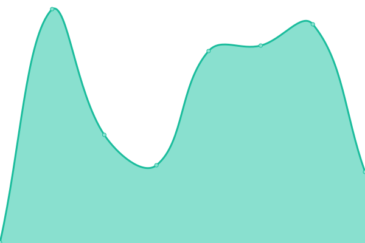 258ms</summary><br><a href="https://Certegy-Payment-Solutions.github.io/upptime/history/cashline-tomcat-cce"></a><br><a href="https://Certegy-Payment-Solutions.github.io/upptime/history/cashline-tomcat-cce"></a><br><a href="https://Certegy-Payment-Solutions.github.io/upptime/history/cashline-tomcat-cce"></a><br><a href="https://Certegy-Payment-Solutions.github.io/upptime/history/cashline-tomcat-cce"></a><br><a href="https://Certegy-Payment-Solutions.github.io/upptime/history/cashline-tomcat-cce"></a></details> | <details><summary><a href="https://Certegy-Payment-Solutions.github.io/upptime/history/cashline-tomcat-cce">100.00%</a></summary><a href="https://Certegy-Payment-Solutions.github.io/upptime/history/cashline-tomcat-cce"></a><br><a href="https://Certegy-Payment-Solutions.github.io/upptime/history/cashline-tomcat-cce"></a><br><a href="https://Certegy-Payment-Solutions.github.io/upptime/history/cashline-tomcat-cce"></a><br><a href="https://Certegy-Payment-Solutions.github.io/upptime/history/cashline-tomcat-cce"></a><br><a href="https://Certegy-Payment-Solutions.github.io/upptime/history/cashline-tomcat-cce"></a></details>
|  [Cashline Tomcat - PROD](https://certegycashline.com/) | 🟩 Up | [cashline-tomcat-prod.yml](https://github.com/Certegy-Payment-Solutions/upptime/commits/HEAD/history/cashline-tomcat-prod.yml) | <details><summary> 271ms</summary><br><a href="https://Certegy-Payment-Solutions.github.io/upptime/history/cashline-tomcat-prod"></a><br><a href="https://Certegy-Payment-Solutions.github.io/upptime/history/cashline-tomcat-prod"></a><br><a href="https://Certegy-Payment-Solutions.github.io/upptime/history/cashline-tomcat-prod"></a><br><a href="https://Certegy-Payment-Solutions.github.io/upptime/history/cashline-tomcat-prod"></a><br><a href="https://Certegy-Payment-Solutions.github.io/upptime/history/cashline-tomcat-prod"></a></details> | <details><summary><a href="https://Certegy-Payment-Solutions.github.io/upptime/history/cashline-tomcat-prod">100.00%</a></summary><a href="https://Certegy-Payment-Solutions.github.io/upptime/history/cashline-tomcat-prod"></a><br><a href="https://Certegy-Payment-Solutions.github.io/upptime/history/cashline-tomcat-prod"></a><br><a href="https://Certegy-Payment-Solutions.github.io/upptime/history/cashline-tomcat-prod"></a><br><a href="https://Certegy-Payment-Solutions.github.io/upptime/history/cashline-tomcat-prod"></a><br><a href="https://Certegy-Payment-Solutions.github.io/upptime/history/cashline-tomcat-prod"></a></details>
|  [Cashline Java - CCE](https://cce.cashline.certegy.com/health) | 🟩 Up | [cashline-java-cce.yml](https://github.com/Certegy-Payment-Solutions/upptime/commits/HEAD/history/cashline-java-cce.yml) | <details><summary> 235ms</summary><br><a href="https://Certegy-Payment-Solutions.github.io/upptime/history/cashline-java-cce"></a><br><a href="https://Certegy-Payment-Solutions.github.io/upptime/history/cashline-java-cce"></a><br><a href="https://Certegy-Payment-Solutions.github.io/upptime/history/cashline-java-cce"></a><br><a href="https://Certegy-Payment-Solutions.github.io/upptime/history/cashline-java-cce"></a><br><a href="https://Certegy-Payment-Solutions.github.io/upptime/history/cashline-java-cce"></a></details> | <details><summary><a href="https://Certegy-Payment-Solutions.github.io/upptime/history/cashline-java-cce">100.00%</a></summary><a href="https://Certegy-Payment-Solutions.github.io/upptime/history/cashline-java-cce"></a><br><a href="https://Certegy-Payment-Solutions.github.io/upptime/history/cashline-java-cce"></a><br><a href="https://Certegy-Payment-Solutions.github.io/upptime/history/cashline-java-cce"></a><br><a href="https://Certegy-Payment-Solutions.github.io/upptime/history/cashline-java-cce"></a><br><a href="https://Certegy-Payment-Solutions.github.io/upptime/history/cashline-java-cce"></a></details>
|  [Cashline Java - PROD](https://cashline.certegy.com/health) | 🟩 Up | [cashline-java-prod.yml](https://github.com/Certegy-Payment-Solutions/upptime/commits/HEAD/history/cashline-java-prod.yml) | <details><summary>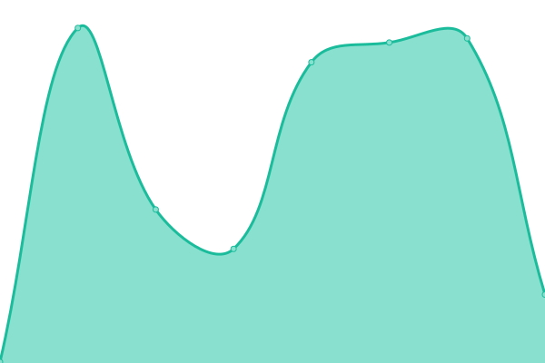 223ms</summary><br><a href="https://Certegy-Payment-Solutions.github.io/upptime/history/cashline-java-prod"></a><br><a href="https://Certegy-Payment-Solutions.github.io/upptime/history/cashline-java-prod"></a><br><a href="https://Certegy-Payment-Solutions.github.io/upptime/history/cashline-java-prod"></a><br><a href="https://Certegy-Payment-Solutions.github.io/upptime/history/cashline-java-prod"></a><br><a href="https://Certegy-Payment-Solutions.github.io/upptime/history/cashline-java-prod"></a></details> | <details><summary><a href="https://Certegy-Payment-Solutions.github.io/upptime/history/cashline-java-prod">100.00%</a></summary><a href="https://Certegy-Payment-Solutions.github.io/upptime/history/cashline-java-prod"></a><br><a href="https://Certegy-Payment-Solutions.github.io/upptime/history/cashline-java-prod"></a><br><a href="https://Certegy-Payment-Solutions.github.io/upptime/history/cashline-java-prod"></a><br><a href="https://Certegy-Payment-Solutions.github.io/upptime/history/cashline-java-prod"></a><br><a href="https://Certegy-Payment-Solutions.github.io/upptime/history/cashline-java-prod"></a></details>
|  [Cashline Admin Portal - CCE](https://cce.cashlineadminportal.com/) | 🟩 Up | [cashline-admin-portal-cce.yml](https://github.com/Certegy-Payment-Solutions/upptime/commits/HEAD/history/cashline-admin-portal-cce.yml) | <details><summary> 305ms</summary><br><a href="https://Certegy-Payment-Solutions.github.io/upptime/history/cashline-admin-portal-cce"></a><br><a href="https://Certegy-Payment-Solutions.github.io/upptime/history/cashline-admin-portal-cce"></a><br><a href="https://Certegy-Payment-Solutions.github.io/upptime/history/cashline-admin-portal-cce"></a><br><a href="https://Certegy-Payment-Solutions.github.io/upptime/history/cashline-admin-portal-cce"></a><br><a href="https://Certegy-Payment-Solutions.github.io/upptime/history/cashline-admin-portal-cce"></a></details> | <details><summary><a href="https://Certegy-Payment-Solutions.github.io/upptime/history/cashline-admin-portal-cce">100.00%</a></summary><a href="https://Certegy-Payment-Solutions.github.io/upptime/history/cashline-admin-portal-cce"></a><br><a href="https://Certegy-Payment-Solutions.github.io/upptime/history/cashline-admin-portal-cce"></a><br><a href="https://Certegy-Payment-Solutions.github.io/upptime/history/cashline-admin-portal-cce"></a><br><a href="https://Certegy-Payment-Solutions.github.io/upptime/history/cashline-admin-portal-cce"></a><br><a href="https://Certegy-Payment-Solutions.github.io/upptime/history/cashline-admin-portal-cce"></a></details>
|  [Cashline Admin Portal - PROD](https://cashlineadminportal.com/) | 🟩 Up | [cashline-admin-portal-prod.yml](https://github.com/Certegy-Payment-Solutions/upptime/commits/HEAD/history/cashline-admin-portal-prod.yml) | <details><summary> 317ms</summary><br><a href="https://Certegy-Payment-Solutions.github.io/upptime/history/cashline-admin-portal-prod"></a><br><a href="https://Certegy-Payment-Solutions.github.io/upptime/history/cashline-admin-portal-prod"></a><br><a href="https://Certegy-Payment-Solutions.github.io/upptime/history/cashline-admin-portal-prod"></a><br><a href="https://Certegy-Payment-Solutions.github.io/upptime/history/cashline-admin-portal-prod"></a><br><a href="https://Certegy-Payment-Solutions.github.io/upptime/history/cashline-admin-portal-prod"></a></details> | <details><summary><a href="https://Certegy-Payment-Solutions.github.io/upptime/history/cashline-admin-portal-prod">100.00%</a></summary><a href="https://Certegy-Payment-Solutions.github.io/upptime/history/cashline-admin-portal-prod"></a><br><a href="https://Certegy-Payment-Solutions.github.io/upptime/history/cashline-admin-portal-prod"></a><br><a href="https://Certegy-Payment-Solutions.github.io/upptime/history/cashline-admin-portal-prod"></a><br><a href="https://Certegy-Payment-Solutions.github.io/upptime/history/cashline-admin-portal-prod"></a><br><a href="https://Certegy-Payment-Solutions.github.io/upptime/history/cashline-admin-portal-prod"></a></details>
|  [Bankpay - CCE](https://cce.bankpay.certegy.com/health) | 🟩 Up | [bankpay-cce.yml](https://github.com/Certegy-Payment-Solutions/upptime/commits/HEAD/history/bankpay-cce.yml) | <details><summary>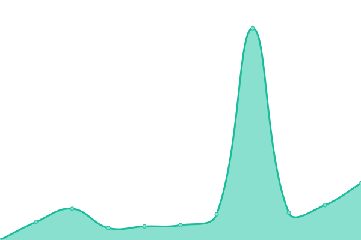 801ms</summary><br><a href="https://Certegy-Payment-Solutions.github.io/upptime/history/bankpay-cce"></a><br><a href="https://Certegy-Payment-Solutions.github.io/upptime/history/bankpay-cce"></a><br><a href="https://Certegy-Payment-Solutions.github.io/upptime/history/bankpay-cce"></a><br><a href="https://Certegy-Payment-Solutions.github.io/upptime/history/bankpay-cce"></a><br><a href="https://Certegy-Payment-Solutions.github.io/upptime/history/bankpay-cce"></a></details> | <details><summary><a href="https://Certegy-Payment-Solutions.github.io/upptime/history/bankpay-cce">9.14%</a></summary><a href="https://Certegy-Payment-Solutions.github.io/upptime/history/bankpay-cce"></a><br><a href="https://Certegy-Payment-Solutions.github.io/upptime/history/bankpay-cce"></a><br><a href="https://Certegy-Payment-Solutions.github.io/upptime/history/bankpay-cce"></a><br><a href="https://Certegy-Payment-Solutions.github.io/upptime/history/bankpay-cce"></a><br><a href="https://Certegy-Payment-Solutions.github.io/upptime/history/bankpay-cce"></a></details>
|  [Bankpay - PROD](https://bankpay.certegy.com/health) | 🟩 Up | [bankpay-prod.yml](https://github.com/Certegy-Payment-Solutions/upptime/commits/HEAD/history/bankpay-prod.yml) | <details><summary> 322ms</summary><br><a href="https://Certegy-Payment-Solutions.github.io/upptime/history/bankpay-prod"></a><br><a href="https://Certegy-Payment-Solutions.github.io/upptime/history/bankpay-prod"></a><br><a href="https://Certegy-Payment-Solutions.github.io/upptime/history/bankpay-prod"></a><br><a href="https://Certegy-Payment-Solutions.github.io/upptime/history/bankpay-prod"></a><br><a href="https://Certegy-Payment-Solutions.github.io/upptime/history/bankpay-prod"></a></details> | <details><summary><a href="https://Certegy-Payment-Solutions.github.io/upptime/history/bankpay-prod">100.00%</a></summary><a href="https://Certegy-Payment-Solutions.github.io/upptime/history/bankpay-prod"></a><br><a href="https://Certegy-Payment-Solutions.github.io/upptime/history/bankpay-prod"></a><br><a href="https://Certegy-Payment-Solutions.github.io/upptime/history/bankpay-prod"></a><br><a href="https://Certegy-Payment-Solutions.github.io/upptime/history/bankpay-prod"></a><br><a href="https://Certegy-Payment-Solutions.github.io/upptime/history/bankpay-prod"></a></details>

<!--end: status pages-->

[**Visit our status website →**](https://Certegy-Payment-Solutions.github.io/upptime)

## 📄 License

- Powered by: [Upptime](https://github.com/upptime/upptime)
- Code: [MIT](./LICENSE) © [Anand Chowdhary](https://anandchowdhary.com), supported by [Pabio](https://pabio.com)
- Data in the `./history` directory: [Open Database License](https://opendatacommons.org/licenses/odbl/1-0/)
